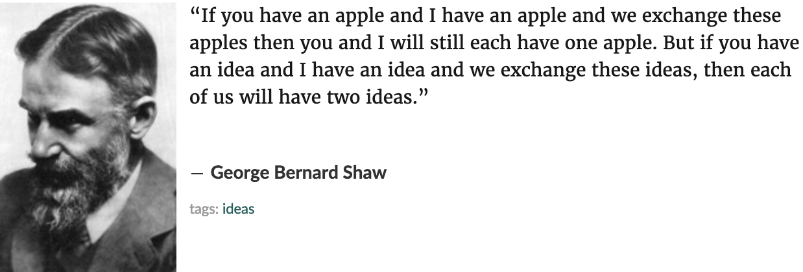
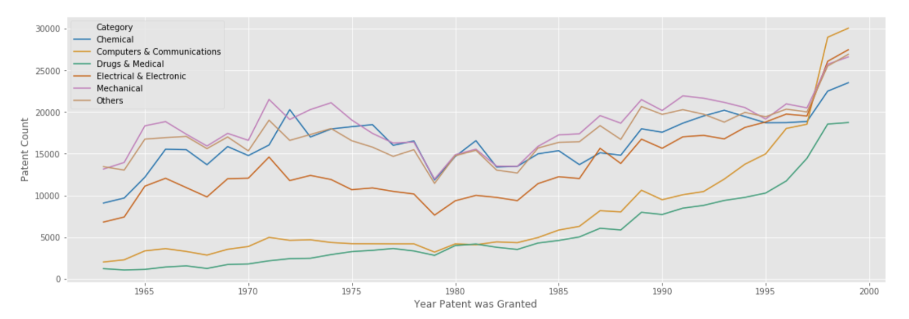

Patent Citation Networks: A Graph Theory Representation

## Motivation:

###### To gain a better understanding of the patent citation network and provide starter tools for others to analyze the patent citation network
---
#### Background:

Despite the 'common knowledge' that they are a flawed measure, patents are commonly used in economic research as a proxy variable for measuring technological progress over time.

*What are Patents*:
Patents are mechanisms for individuals, companies, or governments to legally “own” ideas. The United States Patent Office (USPO) states that a granted patent gives the patent owner **“the right to exclude others from making, using, offering for sale, or selling”** an idea or process for 20 years after the patent is granted, thus creating a legal monopoly over the implementation of an idea. However, that monopoly must be enforced by the patent filer not the patent office.

*Why do we have Patents*:
Patents are meant to encourage economic innovation through increasing investment in research, encouraging companies to share ideas instead of keeping "trade secrets," and protecting the rights for humans to benefit from "the product of his/her mind." This rational sounds great in theory, but are they what we see in practice today.

---
## Enter the "Patent Troll"

*Definition:* __"A company that obtains the rights to one or more patents in order to profit by means of licensing or litigation, rather than by producing its own goods or services."__

Instead of producing economic good patent troll's will buy patents from companies who need to liquidate assets, then turn around to other companies and demand royalties under threat of an expensive lawsuit.

These patent trolls can get really creative in what patens they buy with intention to collect royalties. In an example they have demanded royalties from things as basic as a business using a copy machine. With the rise of the internet and free source sharing platforms we want to encourage the creating and sharing of ideas.

 ---

### Data
The data I used for this project was provided by The National Bureau of Economic Research and fully described in the paper bellow.

_Hall, B. H., A. B. Jaffe, and M. Trajtenberg (2001). "The NBER Patent Citation Data File: Lessons, Insights and Methodological Tools." NBER Working Paper 8498._

My data set consisted of just under 3 million Utility Patents granted by the USPO between the years of 1963 and 1999, and the patent numbers cited by those 3 million Utility Patents consisting of over 16 million patent citation links. The Utility Patents are categorically split from over 400 official patent classes into constructed variables of 6 categories and 36 subcategories. This was provided by Jaffe, and Trajtenberg (2001).

The 6 Categories
1) Chemical
2) Computers and Communications
3) Drugs and Medical
4) Electrical and Electronics
5) Mechanical
6) Others

*Utility patents*: may be granted to anyone who invents or discovers any new and useful process, machine, article of manufacture, or composition of matter, or any new and useful improvement thereof;

---
### Exploratory Data Analysis (EDA)

##### Patents by Year by Category

Looking across patents by year split up by category we see a noticable drop in patent count before 1978 and a fast rise at the tail of this graph around 1997 where patent counts really start to rise.

##### Average Number of Patent Citation by Year by Category 1975 - 1999

Now I wanted to look at citation count per patent over time. This shows that there is a general upward trend across the years as patents cite more and more patents.

#### Line of best fit for all Subcategories patent count over 1963-1999

There is a lot of noise in this graph here, but I wanted to give the reader a look into how the subcategory patent counts change over the years. A noticeable observation is all lines of best fit are not pointed in the positive direction. In fact Organic Compounds in the Chemical category has a fairly sharp decrease in its line of best fit.

---

## Graphs

#### Patent Network for Genetically Modified Mammals

Here is the patent network for the genetically modified mammals patent found at the top in white. Each color change across the graph downward indicates an increase in shortest longest graph.

#### Betweenness Centrality

A higher betweenness centrality is indicative of in degree node of the weighted edge having a larger citation network then the other side of the split.

- Betweenness Centrality .03 --> PN 4299815 Cacinoembryonic antigens
- Betweenness Centrality .02 Sprouting from PN 4098876: Reverse sandwich immunoassay
- Betweenness Centrality .02 --> PN 3995019: Diagnostic reagent system:
- Betweenness Centrality .01 --> PN 3896217: Method and apparatus for radioimmunoassay with regeneration of immunoadsorbent
- Betweenness Centrality .01 --> PN 3975511: Solid phase radioimmunoassay

#### Same Graph with Patent Titles as Node Labels

I did a google search of patent titles and labeled the corresponding nodes. An interesting finding is that multiple patents were titled 'Cacinoembryonic antigens' and through key words alone one can see this citation network for genetically modified mammals.

#### Categories citing across categories

Nodes are each subcategory and edges are labeled with weights that correspond to the number of times that subcategory cited the other subcategory.

---
### Summary
There is a lot of analysis to be completed by understanding a network and I have just scratched the surface.

---
### Future Work
- Utilizing more advanced software for displaying graphs
- Create a better dashboard for others to analyze patents of interest
- Look into how companies react when trying to "box out" competition
- Look into effects on a subcategory network of patent expiration
- Identify centrality measures as metrics
